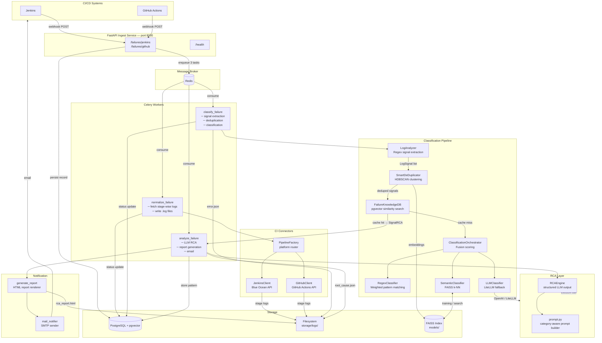
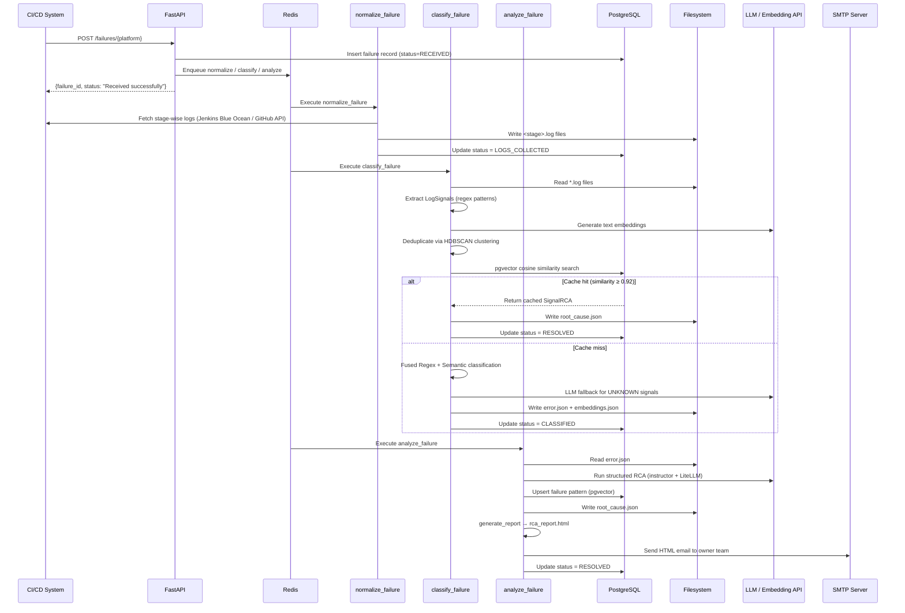

<div align="center">

# 🔍 CI Root Cause Analyzer

**Stop hunting through logs. Let AI tell you exactly what broke and who owns it.**

[](https://python.org)
[](https://fastapi.tiangolo.com)
[](https://docs.celeryq.dev)
[](https://postgresql.org)
[](https://redis.io)
[](https://docker.com)
[](https://litellm.ai)

<br/>

> Your pipeline fails. Instead of digging through hundreds of lines of logs, this agent automatically fetches them, classifies the failure, runs LLM-powered root cause analysis, and emails a structured incident report to the right team — **in seconds, not hours.**

<br/>

[](https://jenkins.io)
[](https://github.com/features/actions)
[](https://gitlab.com)
[](https://circleci.com)
[](https://azure.microsoft.com/en-us/products/devops)
[](https://bitbucket.org)

</div>

---

Built on a **three-stage classification pipeline** (regex → semantic → LLM fallback) with a self-learning knowledge store: the more failures it sees, the faster and more accurate it gets.

Supports two modes of operation:
- **🌐 Webhook-driven HTTP API** (FastAPI + Celery) — for production pipelines with Jenkins and GitHub Actions native integration
- **⌨️ CLI** (`cli.py`) — for local debugging and one-off analysis from any CI/CD service, no Redis or database setup required

---

## 📑 Table of Contents

- [🏗️ Architecture](#️-architecture)
- [🔄 Data Flow](#-data-flow)
- [🧩 Components](#-components)
- [📁 Project Structure](#-project-structure)
- [✅ Prerequisites](#-prerequisites)
- [⚙️ Installation](#️-installation)
- [🔧 Configuration](#-configuration)
- [🚀 Running the Services](#-running-the-services)
- [⌨️ CLI](#️-cli)
- [📡 API Reference](#-api-reference)
- [🧠 Classification Pipeline](#-classification-pipeline)
- [🛠️ Development](#️-development)

---

## 🏗️ Architecture



---

## 🔄 Data Flow



---

## 🧩 Components

| Component | Path | Responsibility |
|---|---|---|
| **🌐 FastAPI App** | `api/app/main.py` | HTTP server, startup hooks |
| **⌨️ CLI App** | `cli.py` | CLI for root cause analysis |
| **📥 Ingest Routes** | `api/routes/ingest.py` | Accept Jenkins/GitHub failure webhooks |
| **❤️ Health Route** | `api/routes/health.py` | Postgres / Redis / Celery health check |
| **🔀 PipelineFactory** | `analyzer/connectors/pipeline_factory.py` | Detect CI platform, delegate log fetch |
| **🔧 JenkinsClient** | `analyzer/connectors/jenkins_client.py` | Jenkins Blue Ocean REST API |
| **🐙 GitHubClient** | `analyzer/connectors/github_client.py` | GitHub Actions REST API |
| **🔎 LogAnalyzer** | `analyzer/extractors/log_analyzer.py` | Regex-based signal extraction from logs |
| **🧹 SmartDeDuplicator** | `analyzer/deduplicator/smart_deduplicator.py` | HDBSCAN semantic deduplication |
| **📐 RegexClassifier** | `analyzer/classifiers/regex_classifier.py` | Weighted regex pattern scoring |
| **🧠 SemanticClassifier** | `analyzer/classifiers/semantic_classifier.py` | FAISS k-NN nearest-neighbour classifier |
| **🤖 LLMClassifier** | `analyzer/classifiers/llm_classifier.py` | LLM fallback for unresolved signals |
| **🎛️ ClassificationOrchestrator** | `analyzer/classifiers/classification_orchestrator.py` | Fuse regex+semantic, auto-learn feedback |
| **🔗 EmbeddingService** | `analyzer/embedding/embedding_service.py` | LiteLLM embedding wrapper (singleton) |
| **🔬 RCAEngine** | `analyzer/rca_engine/rca_engine.py` | LLM-based structured RCA |
| **📄 generate_report** | `analyzer/notifier/generate_report.py` | HTML incident report builder |
| **📧 mail_notifier** | `analyzer/notifier/mail_notifier.py` | SMTP email dispatch |
| **🗄️ DatabaseInit** | `storage/database.py` | PostgreSQL schema bootstrap |
| **💾 LogStorer** | `storage/logs.py` | Read/write log and result files |
| **📋 PipelineFailureDB** | `storage/pipeline_failure_record.py` | Failure metadata CRUD |
| **🧬 FailureKnowledgeDB** | `storage/failure_knowledge_record.py` | pgvector pattern store + similarity search |
| **⚙️ Celery Tasks** | `workers/tasks.py` | normalize / classify / analyze async tasks |

---

## 📁 Project Structure

```
ci-root-cause-analyzer/
├── api/
│   ├── app/
│   │   ├── config.py           # Pydantic settings (reads from .env)
│   │   └── main.py             # FastAPI application factory
│   ├── routes/
│   │   ├── health.py           # GET /health
│   │   └── ingest.py           # POST /failures/jenkins, /failures/github
│   └── schemas/                # Pydantic request / response models
├── analyzer/
│   ├── classifiers/
│   │   ├── classification_orchestrator.py   # Fusion + auto-learn
│   │   ├── failure_patterns.py              # Load YAML patterns
│   │   ├── failure_patterns.yaml            # Regex patterns per category
│   │   ├── llm_classifier.py                # LLM fallback classifier
│   │   ├── regex_classifier.py              # Weighted regex scorer
│   │   ├── semantic_classifier.py           # FAISS k-NN classifier
│   │   └── training/
│   │       └── synthetic_data_generator.py  # Bootstrap training data
│   ├── connectors/
│   │   ├── github_client.py    # GitHub Actions API client
│   │   ├── jenkins_client.py   # Jenkins Blue Ocean API client
│   │   └── pipeline_factory.py # Platform detection + routing
│   ├── deduplicator/
│   │   └── smart_deduplicator.py   # HDBSCAN-based dedup
│   ├── embedding/
│   │   └── embedding_service.py    # LiteLLM embedding singleton
│   ├── extractors/
│   │   └── log_analyzer.py         # Log → LogSignal extraction
│   ├── notifier/
│   │   ├── generate_report.py      # HTML report generator
│   │   └── mail_notifier.py        # SMTP email sender
│   ├── ownership/
│   │   └── ownership_config.py     # Category → team mapping
│   └── rca_engine/
│       ├── prompt.py               # Category-aware prompt builder
│       └── rca_engine.py           # Structured LLM RCA runner
├── models/
│   ├── semantic.faiss          # FAISS flat L2 index
│   └── semantic.pkl            # SemanticClassifier metadata
├── storage/
│   ├── database.py             # PostgreSQL init / table bootstrap
│   ├── failure_knowledge_record.py  # pgvector knowledge store
│   ├── init.sql                # SQL init script for Docker
│   ├── logs.py                 # Log file read/write helpers
│   └── pipeline_failure_record.py   # Failure metadata store
├── utils/
│   ├── execute_notifier.py     # Report + email orchestrator
│   ├── hash_utils.py           # SHA-256 fingerprint generator
│   └── text_normalizer.py      # Log text normalization
├── workers/
│   ├── celery_app.py           # Celery app + broker config
│   └── tasks.py                # normalize / classify / analyze tasks
├── cli.py                  # CLI entry point (no Celery/Redis required)
├── docker-compose.yml
├── Dockerfile
├── pyproject.toml
└── requirements.txt
```

---

## ✅ Prerequisites

| Requirement | Details |
|---|---|
| 🐳 **Docker** ≥ 24 + **Docker Compose** ≥ 2 | Required for containerised deployment |
| 🤖 **LLM API key** | Any LiteLLM-compatible provider (OpenAI, Azure, Groq, etc.) |
| 📧 **SMTP account** | For email delivery of RCA reports |
| 🔧 **Jenkins** or **GitHub Actions** | CI system to send webhooks (HTTP API mode) |

---

## ⚙️ Installation

```bash
# Clone repository
git clone <repo-url>
cd ci-root-cause-analyzer

# Copy the environment template and fill in values
cp .env.example .env
```

---

## 🔧 Configuration

Create a `.env` file in the project root:

```dotenv
# 🗄️ PostgreSQL
POSTGRES_USER=agentic
POSTGRES_PASSWORD=agentic
POSTGRES_DB=agentic_db
DB_HOST=postgresql
DB_PORT=5432

# ⚡ Redis
REDIS_HOST=redis
REDIS_PORT=6379

# 🔧 Jenkins
JENKINS_URL=https://<jenkins-host>/blue/rest/organizations/jenkins/
JENKINS_USER=<username>
JENKINS_TOKEN=<api-token>

# 🐙 GitHub
GITHUB_TOKEN=<personal-access-token>
GITHUB_API_BASE_URL=https://api.github.com

# 🤖 LLM (any LiteLLM-supported provider)
LLM_API_KEY=<api-key>
RCA_LLM_DEPLOYMENT=gpt-4o-mini
EMBEDDING_MODEL=text-embedding-3-small
RCA_TEMPERATURE=0
CLASSIFY_TEMPERATURE=0

# 📧 SMTP
SMTP_SERVER=smtp.example.com
SMTP_PORT=587
SMTP_USER=sender@example.com
SMTP_PASSWORD=<password>
DEFAULT_MAIL=fallback@example.com

# 💾 Storage
LOG_PATH=storage/logs
SEMANTIC_PATH=models/semantic.pkl
FAILURE_TABLE=failures
FAILURE_PATTERN_TABLE=failure_knowledge_table
```

---

## 🚀 Running the Services

### 🐳 Docker Compose (recommended)

```bash
# Build and start all services
docker compose up --build

# Start in detached mode
docker compose up --build -d

# View logs
docker compose logs -f ingest
docker compose logs -f dev_agent

# Stop all services
docker compose down
```

**Services started:**

| Service | Port | Description |
|---|---|---|
| 🗄️ `postgresql` | `5432` | PostgreSQL 17 + pgvector |
| ⚡ `redis` | `6379` | Redis 8 message broker |
| 🌐 `ingest` | `8000` | FastAPI ingest service |
| ⚙️ `dev_agent` | — | Celery worker |

### 💻 Local Development

```bash
# Install dependencies
pip install -r requirements.txt

# Start FastAPI
uvicorn api.app.main:app --host 0.0.0.0 --port 8000 --reload

# Start Celery worker (separate terminal)
celery -A workers.tasks worker --loglevel=INFO -P solo

# Pre-generate semantic classifier training data
python -c "from analyzer.classifiers.training.synthetic_data_generator import generate_and_save; generate_and_save()"
```

---

## ⌨️ CLI

`cli.py` runs the full analysis pipeline **synchronously and without Celery or Redis** — useful for local debugging, one-off analysis, and CI scripts. It calls the same underlying service functions as the Celery tasks.

The `analyze logs` subcommand accepts plain `.log` files from **any source** — Jenkins, GitHub Actions, GitLab CI, CircleCI, Bitbucket Pipelines, Azure DevOps, or any custom service.

```bash
pip install -r requirements.txt   # includes typer[all]
```

### 🏳️ `--use-db` flag

All three subcommands accept `--use-db` (off by default). Without it, **no PostgreSQL connection is required**.

| With `--use-db` you get | Without `--use-db` |
|---|---|
| ✅ Failure records persisted to PostgreSQL | ❌ No DB writes |
| ✅ pgvector cache lookup (≥ 0.92 similarity = instant recall) | ❌ Always runs full RCA |
| ✅ Newly analysed patterns stored for future cache hits | ❌ No pattern learning |

### 📦 Subcommands

#### `analyze jenkins` — fetch logs from Jenkins

```bash
# fully local — no database needed
python cli.py analyze jenkins \
  --job-name "my-project/my-pipeline" \
  --build-number 42 \
  --commit abc123 \
  --branch main

# with DB persistence and email
python cli.py analyze jenkins \
  --job-name "my-project/my-pipeline" \
  --build-number 42 \
  --commit abc123 \
  --branch main \
  --dev-email dev@example.com \
  --ci-email devops@example.com \
  --use-db
```

> Prompts for any omitted required options.

#### `analyze github` — fetch logs from GitHub Actions

```bash
# fully local — no database needed
python cli.py analyze github \
  --owner my-org \
  --repo my-repo \
  --run-id 12345678 \
  --commit abc123 \
  --branch main

# with DB persistence
python cli.py analyze github \
  --owner my-org --repo my-repo --run-id 12345678 \
  --commit abc123 --branch main \
  --dev-email dev@example.com \
  --use-db
```

#### `analyze logs` — analyze local `.log` files from any CI/CD service

No Jenkins or GitHub connection needed. Point the command at any directory containing `.log` files — from **any CI/CD platform**:

```bash
# fully local — no database needed
python cli.py analyze logs ./my-logs/

# with email notification
python cli.py analyze logs ./my-logs/ \
  --dev-email dev@example.com \
  --branch feature/auth

# enable pgvector knowledge-store lookup and pattern storage
python cli.py analyze logs ./my-logs/ --use-db
```

The command copies your `.log` files into `storage/logs/<failure_id>/`, runs the full extract → deduplicate → classify → RCA chain, and writes results alongside them.

### 📊 HTTP Pipeline vs CLI Comparison

| Capability | 🌐 HTTP + Celery | ⌨️ CLI (default) | ⌨️ CLI (`--use-db`) |
|---|:---:|:---:|:---:|
| Async / parallel tasks | ✅ | ❌ sequential | ❌ sequential |
| Redis broker | required | not needed | not needed |
| PostgreSQL | required | **not needed** | required |
| Failure record + status tracking | ✅ | ❌ | ✅ |
| pgvector cache lookup | ✅ | ❌ | ✅ |
| Pattern auto-learning | ✅ | ❌ | ✅ |
| HTML report + email | ✅ | ✅ | ✅ |

### 📂 Output Files

Results are written to `storage/logs/<failure_id>/`:

| File | Contents |
|---|---|
| 📄 `<stage>.log` | Raw stage logs (jenkins/github) or copied input logs |
| 🔍 `error.json` | Classified signals with category, confidence, owner |
| 🧠 `root_cause.json` | Structured RCA results per signal |
| 📊 `rca_report.html` | HTML incident report (same as emailed report) |

---

## 📡 API Reference

### `POST /failures/jenkins`

Ingest a Jenkins pipeline failure.

**Request body:**

```json
{
  "commit": "abc123def456",
  "branch": "main",
  "job_name": "my-project/my-pipeline",
  "build_number": 42,
  "mailRecipient": {
    "dev_email": "dev@example.com",
    "test_email": "qa@example.com",
    "ci_email": "devops@example.com"
  }
}
```

**Response:**

```json
{
  "failure_id": "550e8400-e29b-41d4-a716-446655440000",
  "data": { "..." : "..." },
  "status": "Received successfully"
}
```

---

### `POST /failures/github`

Ingest a GitHub Actions workflow failure.

**Request body:**

```json
{
  "commit": "abc123def456",
  "branch": "main",
  "repo": "my-repo",
  "owner": "my-org",
  "run_id": 12345678,
  "mailRecipient": {
    "dev_email": "dev@example.com",
    "ci_email": "devops@example.com"
  }
}
```

**Response:** same shape as Jenkins response.

---

### `GET /health`

Returns liveness and readiness of all dependencies.

**Response:**

```json
{
  "status": "healthy",
  "postgres": { "status": "ok", "latency_ms": 1.23 },
  "redis":    { "status": "ok", "latency_ms": 0.45 },
  "celery":   { "status": "ok", "workers": 1, "worker_names": ["celery@hostname"] }
}
```

> 📖 **Interactive API Docs** (after starting the service):
> - Swagger UI: [http://localhost:8000/docs](http://localhost:8000/docs)
> - ReDoc: [http://localhost:8000/redoc](http://localhost:8000/redoc)

---

## 🧠 Classification Pipeline

Failures are classified across **3 categories** using a three-stage pipeline:

| Stage | Method | Fallback |
|---|---|---|
| 1️⃣ **Regex** | Weighted pattern matching against error line, context and stage | — |
| 2️⃣ **Semantic** | FAISS k-NN on OpenAI embeddings | Trained on synthetic data |
| 3️⃣ **LLM** | LiteLLM structured output | Only for `UNKNOWN` signals |

### 🏷️ Failure Categories

| Category | Covers | Owner Team |
|---|---|---|
| 🔴 `DEV_FAILURE` | Compilation errors, linker failures, missing dependencies, code quality gate failures | 👩‍💻 Developers |
| 🟡 `TEST_FAILURE` | Test assertion failures, flaky tests, fixture/snapshot mismatches, test timeouts | 🧪 QA Engineers |
| 🔵 `CI_INFRA_FAILURE` | Pipeline config, env/secrets, artifact publishing, Docker, Kubernetes, network, resource exhaustion, CI agents | 🛠️ DevOps Engineers |

### ⚖️ Fusion Scoring

Regex and semantic scores are combined with fixed weights before applying per-category confidence thresholds:

```
fused_score = (0.65 × regex_confidence) + (0.35 × semantic_confidence)
```

Signals whose fused score falls below `ABSOLUTE_MIN_CONFIDENCE = 0.20` are always marked `UNKNOWN` and routed to the LLM classifier.

### 🔁 Auto-Learning

High-confidence classifications (`confidence > 0.80`) are fed back into the FAISS index as new training examples. After **20 feedback samples** accumulate the index is retrained and persisted to `models/semantic.faiss` + `models/semantic.pkl`.

---

## 🛠️ Development

### 🧪 Running Tests

```bash
pytest
```

### 🔄 Regenerating Synthetic Training Data

```bash
python -m analyzer.classifiers.training.synthetic_data_generator
```

### 📖 Interactive API Docs

After starting the service, open:

- 🟢 Swagger UI: [http://localhost:8000/docs](http://localhost:8000/docs)
- 📘 ReDoc: [http://localhost:8000/redoc](http://localhost:8000/redoc)